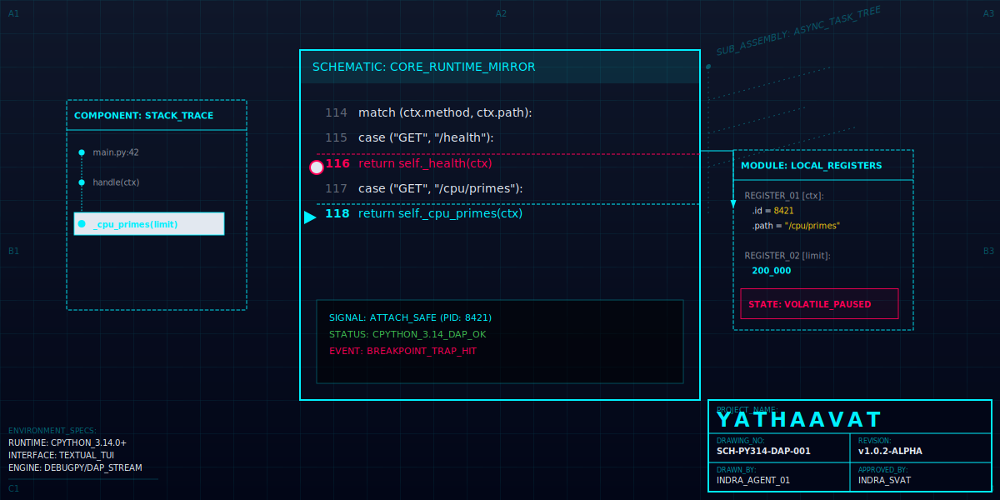

<p align="center">
  
</p>

<p align="center">
  <i>yathaavat</i> (Sanskrit): "as it is", "accurately / truly"
</p>

<p align="center">
  Terminal-first visual debugger for <b>Python 3.14+</b><br>
  Textual UI · DAP/debugpy · keyboard-first · safe attach
</p>

<p align="center">
  <a href="#install">Install</a> ·
  <a href="#quickstart">Quickstart</a> ·
  <a href="#features">Features</a> ·
  <a href="#keyboard-reference">Keys</a> ·
  <a href="#demo-flows">Demos</a> ·
  <a href="#development">Development</a>
</p>

---

## Install

Requires `uv` and Python 3.14.

```bash
curl -fsSL https://raw.githubusercontent.com/indrasvat/yathaavat/main/install.sh | bash
```

Or install directly:

```bash
uv tool install --python python3.14 git+https://github.com/indrasvat/yathaavat
```

## Quickstart

```bash
yathaavat                  # launch the TUI
```

Inside the TUI, press `Ctrl+R` and type `examples/demo_target.py` to launch a demo script under the debugger. Press `Ctrl+P` to open the command palette and discover all available commands.

## Features

- **Three debug workflows** — Launch a script (`Ctrl+R`), connect to a debugpy server (`Ctrl+K`), or attach to a running process by PID (`Ctrl+A`) — all with fuzzy discovery, MRU history, and `~` path expansion. The attach picker detects existing debugpy DAP endpoints and Python 3.14 safe-attach candidates, including remote-debug policy blocks.
- **Breakpoints** — toggle at cursor, add by `file:line` with conditions / hit counts / logpoints, queued while disconnected and auto-applied on connect
- **Source navigation** — inline Find (`Ctrl+F`), Go to line (`Ctrl+G`), Jump to execution (`Ctrl+E`), Run to cursor (`Enter`)
- **Exception panel** — structured traceback tree on exception stops, chained exceptions with `↳ caused by:` / `↳ during handling:` labels, ExceptionGroup support, jump to frame (`Enter`), copy traceback (`y`), add breakpoint at raise site (`a`)
- **Inspection** — expandable locals tree, watch expressions with change tracking, expression console with DAP tab-completion
- **Asyncio tasks panel** — live task snapshot at every stop (id · name · state · coroutine · location · awaiting), flat table or tree (await graph) view, cycle detection, jump to the task's suspended frame with `Enter`
- **Tri-pane layout** — Stack + Breakpoints | Source | Locals + Watches + Exception, with Console and Transcript below
- **Command palette** — `Ctrl+P` for fuzzy search across all commands with keybinding hints
- **Gutter markers** — `●` verified, `◌` pending, `✗` failed, `▶` execution line
- **Zoom** — `F2` maximizes any pane, `F2` again restores layout

## Keyboard Reference

| Key | Action |
|-----|--------|
| `Ctrl+R` | Launch a Python script under debugpy |
| `Ctrl+K` | Connect to a debugpy server (host:port) |
| `Ctrl+A` | Attach to a running process by PID |
| `Ctrl+P` | Command palette (fuzzy search) |
| `c` | Continue |
| `n` | Step over |
| `s` | Step in |
| `u` | Step out |
| `p` | Pause |
| `b` | Toggle breakpoint at cursor |
| `Ctrl+B` | Add breakpoint by file:line |
| `Ctrl+W` | Add watch expression |
| `Ctrl+F` | Find in source |
| `Ctrl+G` | Go to line |
| `Ctrl+E` | Jump to execution line |
| `Enter` | Run to cursor (Source, paused) |
| `y` | Copy traceback (Exception panel) |
| `a` | Add breakpoint at frame (Exception panel) |
| `F2` | Zoom / unzoom focused pane |
| `Tab` | Cycle focus between panes |
| `Esc` | Close dialog / cancel |
| `Ctrl+Q` | Quit |

## Demo Flows

### Launch a script

```bash
yathaavat                  # Ctrl+R → examples/demo_target.py
```

### Connect to a running service

```bash
# Terminal A — start the demo HTTP service (debugpy listening on :5678)
make demo-service

# Terminal B — connect yathaavat
yathaavat                  # Ctrl+K → 127.0.0.1:5678

# Terminal C — trigger a breakpoint via HTTP
curl http://127.0.0.1:8000/debug/break
```

### Attach to a vanilla process (no debugpy in code)

```bash
# Terminal A — plain stdlib HTTP server, zero debugpy imports
make vanilla-service

# Terminal B — attach by PID. Python 3.14 targets use safe attach when available;
# the picker falls back or shows policy/permission guidance when it is blocked.
sudo yathaavat             # Ctrl+A → select vanilla_service.py → Enter
```

### Drive endpoints while debugging

```bash
curl http://127.0.0.1:8000/health
curl 'http://127.0.0.1:8000/cpu/primes?limit=200000'
curl http://127.0.0.1:8000/debug/break
```

## Development

```bash
make sync          # install deps + git hooks (requires uv + python3.14)
make run           # launch TUI
make test          # pytest
make ci            # format + lint + typecheck + test + shellcheck
make release V=x.y.z  # tag + push → GitHub Actions builds + releases
make help          # list all targets
```

## Docs

- [`docs/DESIGN_v2.md`](docs/DESIGN_v2.md) — interaction model, layout system, and roadmap
- [`docs/research/`](docs/research/) — landscape survey, terminal constraints, UX best practices

## License

MIT
